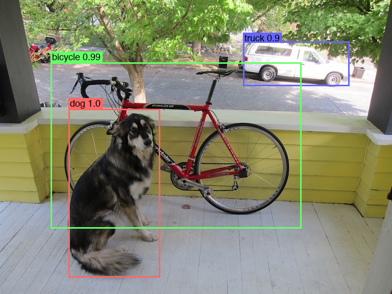

# d2k: YOLOv3 in Keras / Tensorflow 2.1, test-first

[](LICENSE)

## Welcome to d2k

D2K reimplements the [YOLOv3](https://pjreddie.com/media/files/papers/YOLOv3.pdf) object detection algorithm
by Joseph Redmon and Ali Farhadi in Keras/TensorFlow 2.1.0.
Most everything was implemented test-first and matches [Darknet](https://github.com/pjreddie/darknet)
(allowing for floating point error fun).

D2K is inference-only so far...  I'll look into adding training as time allows.



## Quick Start

The YOLOv3 weights file is too big for GitHub, so after cloning this repository you'll
need to get it from the Darknet site:
```bash
pushd darknet
wget https://pjreddie.com/media/files/yolov3.weights
popd
```

You shouldn't have to install anything.  On an Python 3, Tensorflow 2 environment try:
```bash
python yolov3.py tests/data/dog.png
```

In Python, using it is as simple as, for example,
```python
network = d2k.network.load(Path('darknet/yolov3.cfg').read_text())
model = network.make_model(Path('darknet/yolov3.weights').read_bytes())
image = d2k.image.load(image_file)
boxes = d2k.network.detect_image(model, image)

im = Image.open(image_file)
d2k.box.draw_boxes(im, boxes)
im.show()
```

### To run the tests

For the tests, you'll need Darknet built on `../darknet`.  You can use the
[original](https://github.com/pjreddie/darknet), but you may want to use
[my clone](https://github.com/jaltmayerpizzorno/darknet) given a couple of
small bugs I fixed (found while coding this project -- aren't tests wonderful?).
```bash
pushd ..
git clone https://github.com/jaltmayerpizzorno/darknet.git
cd darknet
make
```

Then return to D2K and simply `make test`:
```bash
popd
make test
```

## More Information

The `d2k.network.Network` class reads a Darknet configuration file and generates an equivalent
Keras model;  its `convert()` outputs a list of Python statements building the model, making it
easy to check (and incorporate elsewhere if desired).  It can also read Darknet YOLOv3
weights into the resulting model, for use and/or for saving as an `.h5` file.

Some of the computation is done in a custom Keras layer.

The files under `darknet` are all originally from [Darknet](https://github.com/pjreddie/darknet),
included here for convenience.

## TODOs

- add training support
- look to support additional (non-YOLOv3) layers

## Other Darknet and YOLO

Others came before me (and did great things).  Here are some of them:

- [Darknet YOLO project](https://pjreddie.com/darknet/yolo/)
- [Darknet on GitHub](https://github.com/pjreddie/darknet)
- [Allan Zellener's YAD2K for Yolo9000](https://github.com/allanzelener/YAD2K)
- [Ultralytics' YOLOv3 in PyTorch](https://github.com/ultralytics/yolov3)
- [Huynh Ngoc Anh's YOLOv3 in Keras](https://github.com/experiencor/keras-yolo3)
